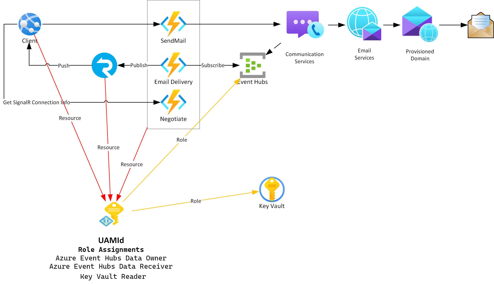

# Wiki

## User Assigned Managed Identities
A UAMI is a resource which allows rource access to be managed in a single place.

### Resources 
* Azure Function
* Static Web Page

### Roles
* Key Vault Secrets User 
  * The Azure Function needs to Read secrects
* Azure Event Hubs Data Receiver
  * The Azure Function needs to subscribe to the Event Hub
* Monitoring Reader 
  * The Azure Function needs to subscribe to the Event Grid System Topic
* SignalR Service Owner
  * The Azure Function needs to publish messages to SignalR 